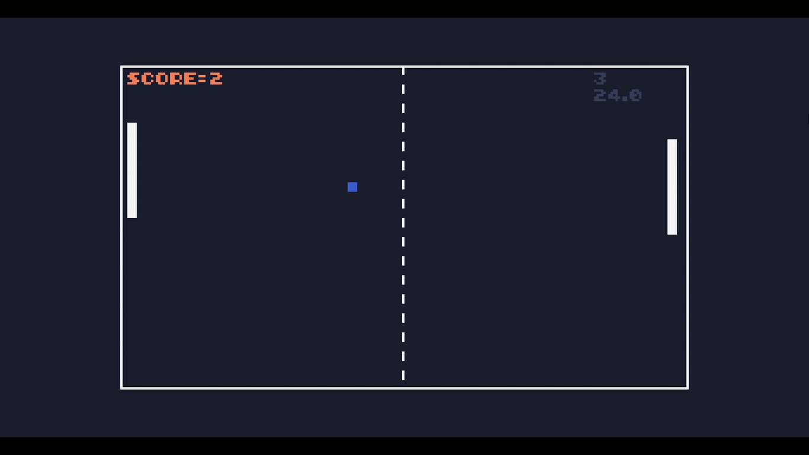
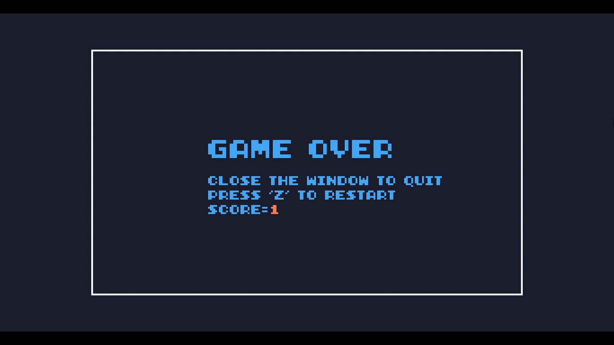

# TIC-80 Pong Clone

A Pong clone made in TIC-80 using Lua.

## Features

- Single-player gameplay
- Paddle collision
- Score tracking

## Controls

| Player | Keys |
|--------|------|
| Player | Up / Down|    

## How to Run

1. Install TIC-80.
2. Open `pong_v1.tic`.
3. Press Run.

## Gameplay

## Game Over Screen

## Author

Ayush Lohar
